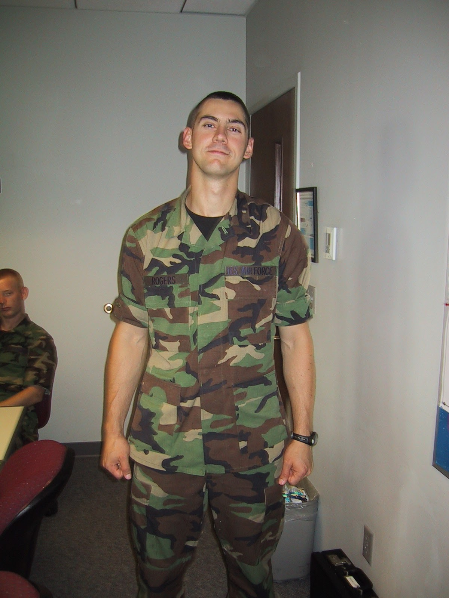
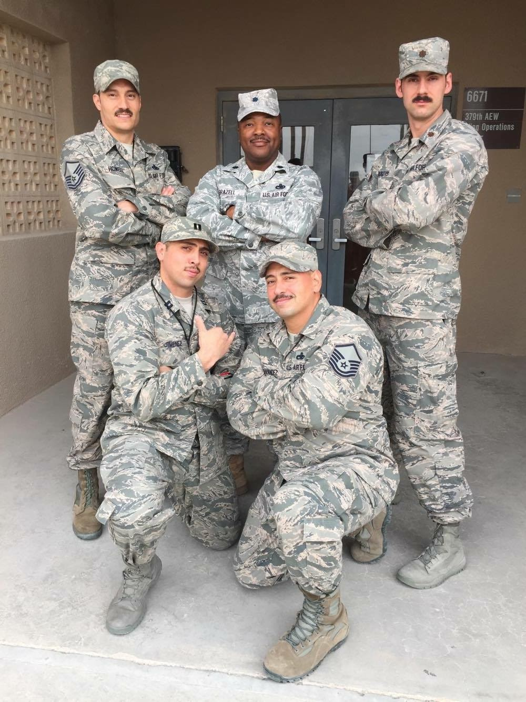
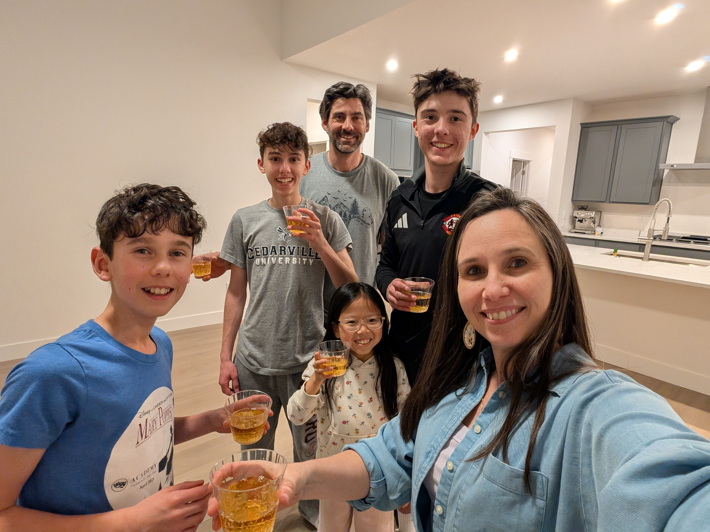

<!-- .slide: class="title-slide" -->

# ECE 444

Antennas, Phased Arrays, and Radar Systems

## Lesson 1 — Course Introduction

Fall 2026 · Dr. Neil Rogers

---

## Welcome

- Who I am
- Who you are
- What this course is going to ask of you

Note:
Instructor bio; ask each student for name, background, one thing they hope to learn.

---

## About your instructor

**Lt Col Neil Rogers, USAF (Ret.)**

<small>BS — TU · MSEE — AFIT · PhD — AFIT</small>

**Erdle Chair**, USAFA
**Field Applications Engineer**, Analog Devices

---

## Where I've been

<small>DF/USAFA · AFRL Directed Energy · NASIC · AFIT ×2 · AFLCMC</small>

---

## Antennas, radar, and high-power RF

  
  
  
  
  
  

<small>OTS · ADS2 · 379th AEW · E-8C · ACUASR · retirement</small>

Note:
Section chief for Active Denial and High-Power Sources at AFRL Directed Energy.
E-8C Joint STARS work at NASIC.
Directed the Academy Center for UAS Research (ACUASR) at USAFA through 2025.

---

## Now — Analog Devices

**Field Applications Engineer** with the team behind the
**ADALM-PHASER** you'll use in Module 3.

---

## Off the clock

  
  
Family — four kids (11 · 13 · 15 · 17)

  
  
CrossFit

  
  
Guitar with the band at <strong>Trace</strong> church

---

## How I teach

- **We're learning this together** — I don't know it all.
- **Mistakes are part of learning** — make them, and make them count.
- **Ask questions** — there is no such thing as a dumb one.

---

## What is an antenna?

An antenna is a **transducer**. It converts a **guided wave** on a cable or
waveguide into a **radiating wave** in free space, and vice versa.

1. Antennas are **reciprocal** — the same antenna transmits and receives with the same pattern.
2. Antennas do **not create energy** — they shape *where* the energy goes.

Note:
Reciprocity: same antenna, same pattern, transmit or receive.
Antennas do not create energy — they shape where the energy goes.

---

## Every wireless system has one

If the antenna is wrong, nothing downstream can fix it.

---

## Why you should care — the AF mission

- **Comms** — HF/VHF/UHF/SATCOM, tactical radios, data links
- **Radar** — surveillance, tracking, targeting, weather
- **EW** — direction finding, jamming, protection
- **Nav** — GPS, TACAN, ILS, IFF
- **ISR** — SIGINT, synthetic aperture radar

---

## Course roadmap

1. Foundations of Electromagnetics and Antennas
2. Antenna types, simulation, measurement
3. Arrays and ADALM-PHASER beamforming
4. Radar fundamentals and FMCW
5. Capstone Project — beamforming + radar

<small>41 lessons, ~15 labs, 2 projects.</small>

---

## Course schedule

  <!-- Row 1: module number + title -->
  
1Foundations

  
2Antenna Types &amp; Measurement

  
3Arrays &amp; Beamforming

  
4Radar &amp; FMCW

  
5Capstone Project

  <!-- Row 2: lesson range -->
  
L1 – L6

  
L7 – L14

  
L15 – L28

  
L29 – L38

  
L39 – L41

  <!-- Row 3: activities + project milestones -->
  

    
EM &amp; antenna theory

  

  

    
3 labs

    
Midterm intro · L11

  

  

    
7 labs · ADALM-PHASER

    
Midterm due · L20

  

  

    
6 labs

  

  

    
Beamforming + radar

  

---

## Two projects

**Midterm** — Antenna Pattern Measurement
- Introduced L11, due L20

**Final** — Combined Beamforming + Radar
- Track a moving target while suppressing a static jammer

---

## Homework

- **Practice sets are your reps.** One per lesson, keyed to that lesson's objectives. Graded on a **genuine, documented attempt** — not on correctness. That is engagement credit (10% of the grade).
- **LO mastery is 30%.** Every objective is scored **Mastered** or **Not Yet Mastered** on the module assessments; your score is the fraction you master.
- **The midterm project is resubmittable.** Mastered / Not Yet Mastered, revise after feedback, turn it in again.

I would rather you learn it <em>late</em> than not at all — so do the reps.

Note:
Point them at the syllabus for the full EC menu: practice, EI, lab prep, a
research paper, or telling me about a bug on the course site.

---

## Know these on sight

  
<strong>dipole</strong> — a resonant wire; the reference antenna, doughnut pattern

  
<strong>Yagi</strong> — one driven element plus parasites; cheap gain along the boom

  
<strong>monopole</strong> — half a dipole over a ground plane; the whip on every vehicle

  
<strong>spiral</strong> — a self-scaling curve; very wideband, circularly polarized

  
<strong>patch</strong> — metal rectangle on a substrate; flat, conformal, printable

  
<strong>parabolic dish</strong> — a focused aperture; the most gain per dollar

  
<strong>horn</strong> — a flared waveguide; clean pattern, the standard gain reference

  

Note:
Geometry sets the job. Do not memorize numbers yet — just be able to name the
shape when it shows up on a rooftop, a mast, or a datasheet.

---

## Show & tell

Real antennas + a software-defined radio.

<!-- physical antennas laid out on bench:
     dipole · monopole · patch · horn · Yagi · small array -->

<!-- SDR (RTL-SDR / HackRF / Phaser) tuned to a live signal;
     swap antennas and observe the spectrum change -->

Note:
Have students predict which antenna will work best for which signal,
then show them the result on the SDR waterfall.

---

## Demo — acoustic beam

Phased array, but audible.

<!-- multi-channel audio interface + Class-D amp
     driving a small speaker line array;
     sweep steering angle so students hear the null / peak -->

Note:
This is our stand-in for phased-array intuition
until we get to Module 3 with the Phaser.

---

## Key point

An antenna is a <strong>transducer</strong>: it trades a guided wave for a radiated one, in either direction, with the same pattern either way. It creates no energy — it only decides <em>where</em> the energy goes. That one choice sits between every transmitter and every receiver in the Air Force, and <strong>nothing downstream can undo it</strong>.

---

## Where this is going

- **Module 1** builds the vocabulary: pattern and gain, polarization and bandwidth, impedance at the terminals, where the far field starts, and how to compute a pattern
- **Modules 2–4** spend it: real antennas, then arrays that steer a beam, then radar that uses the beam
- **Module 5** puts both together on one system — beamform *and* detect

Next lesson: the fundamental <strong>antenna properties</strong>.

---

## Read before next time

<!-- TODO: source syllabus-qr.png and place at book/module01/L01-course-intro/img/syllabus-qr.png
<figure class="qr qr-right">
  
  <figcaption>Syllabus</figcaption>
</figure>
-->

Reference:

- Sections 1-1 through 1-11.7 in [Milligan — *Modern Antenna Design*](../_static/materials/Antenna-design-Milligan.pdf)
- Sections 3.1 through 3.9 in [Rohde &amp; Schwarz — *Antenna Basics*](../_static/materials/Antenna_Basics_8GE01_1e_Rohde-Schwarz.pdf)

Scan the <strong>syllabus</strong> too — grading, EC, and the lab schedule live there.

