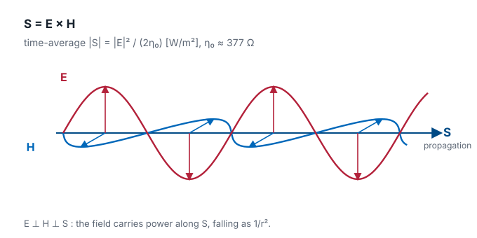
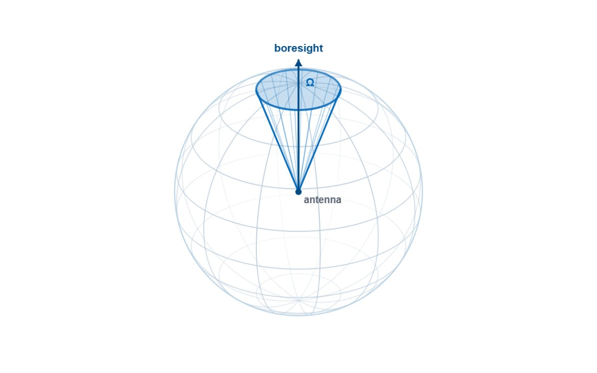
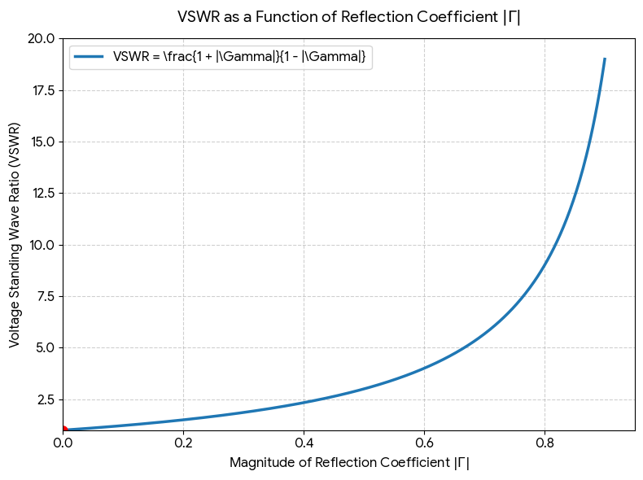
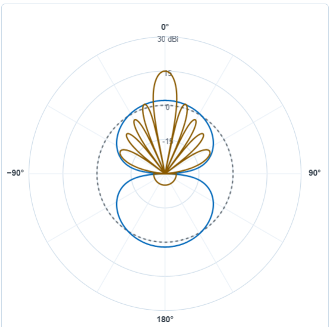
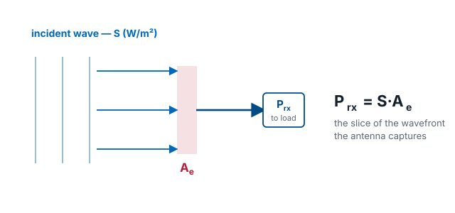
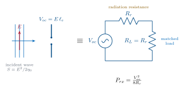
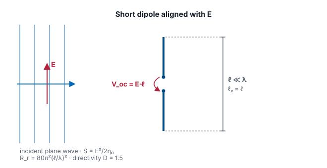
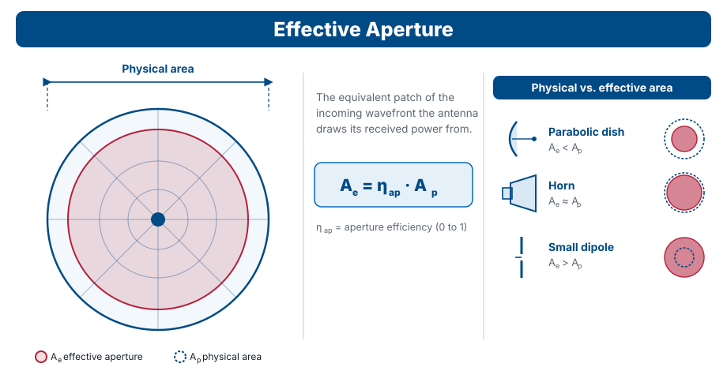
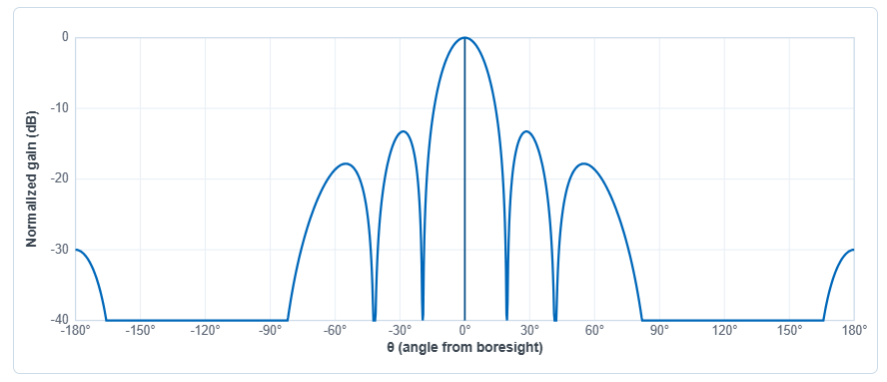

<!-- .slide: class="title-slide" -->

# ECE 444

Antennas, Phased Arrays, and Radar Systems

## Lesson 2 — Basic Properties and Terminology

Fall 2026 · Dr. Neil Rogers

---

## Where we were

- L1: an antenna is a **transducer** — guided wave ↔ radiated wave
- Reciprocal, doesn't create energy
- Every wireless system has at least one

Today we build the **vocabulary** for the rest of Module 1.

Note:
Two-minute recap. Move fast — most of today is new material.

---

## Today's plan

1. Physics chain: **Maxwell → telegrapher's → wave equation → solution**
2. What a "wave" actually looks like in time and space
3. Parameters: **directivity, gain, effective area, beamwidth, lobes**

Every field in this course depends on <strong>both</strong> time and space.

---

## Part 1

### From Maxwell to Waves

<small>Refresher. If any of this is unfamiliar, come see me — the rest of the course rests on it.</small>

---

## Maxwell's equations (source-free region)

$$
\nabla \cdot \mathbf{E} = 0
\qquad
\nabla \cdot \mathbf{H} = 0
$$

$$
\nabla \times \mathbf{E} = -\mu \frac{\partial \mathbf{H}}{\partial t}
$$

$$
\nabla \times \mathbf{H} = \varepsilon \frac{\partial \mathbf{E}}{\partial t}
$$

A <strong>time</strong> change in one field forces a <strong>space</strong> curl in the other.

Note:
This coupling — time change in one produces space curl in the other — is
what makes waves. Slow this slide down; make sure everyone sees where the
time and space derivatives live.

---

## The Telegrapher's Equations

On a two-conductor line, voltage $v(z, t)$ and current $i(z, t)$:

$$
\frac{\partial v}{\partial z} = -L \frac{\partial i}{\partial t}
$$

$$
\frac{\partial i}{\partial z} = -C \frac{\partial v}{\partial t}
$$

Same structure as the curl pair: **space on the left, time on the right.**

Note:
Ask the class: what happens if you differentiate the first with respect to
z and substitute the second? You get the 1-D wave equation for v.

---

## Both give you the wave equation

Free space, source-free region:

$$
\nabla^{2} \mathbf{E} - \mu \varepsilon \frac{\partial^{2} \mathbf{E}}{\partial t^{2}} = 0
$$

Transmission line:

$$
\frac{\partial^{2} v}{\partial z^{2}} - L C \frac{\partial^{2} v}{\partial t^{2}} = 0
$$

Second derivative in space, second derivative in time, tied by a speed.

$c = 1 / \sqrt{\mu \varepsilon}$, $\quad u = 1 / \sqrt{L C}$

---

## The Plane Wave Solution

Traveling in $+\hat{z}$, linearly polarized along $\hat{x}$:

$$
\mathbf{E}(z, t) = \hat{x}\, E_{0} \cos(\omega t - k z)
\qquad
\mathbf{H}(z, t) = \hat{y}\, \frac{E_{0}}{\eta_{0}} \cos(\omega t - k z)
$$

- $\omega = 2 \pi f \longrightarrow$  **time** frequency
- $k = 2 \pi / \lambda \longrightarrow$ **space** frequency (wave number)
- $\omega / k = c \longrightarrow$ **crest speed/phase velocity**
- $\mathbf{H} \perp \mathbf{E}$, in phase, with $|\mathbf{E}| / |\mathbf{H}| = \eta_{0} \approx 377\ \Omega$

Freeze <em>t</em> $\longrightarrow$ you see a wave in space. 

Freeze <em>z</em> $\longrightarrow$ you see a wave in time.

↗ Interactive on the lesson page

Note:
Draw the two snapshots on the chalkboard. This is the intuition slide.

---

## Impedance of free space

Faraday forces $\mathbf{H} \perp \mathbf{E}$, both transverse to $\hat{z}$:

$$
\eta_{0}
= \frac{|\mathbf{E}|}{|\mathbf{H}|}
= \sqrt{\frac{\mu_{0}}{\varepsilon_{0}}}
\approx 377\ \Omega
$$

Far from any antenna, the radiated field looks **locally like a plane
wave**: transverse E and H, ratio $\eta_{0}$, amplitude falling as $1/r$.

<small>We'll derive the 1/r factor from the radiation integrals soon!</small>

---

## Why Phasors Work

We agree to write

$$
\mathbf{E}(\mathbf{r}, t)
= \operatorname{Re}\left\lbrace \tilde{\mathbf{E}}(\mathbf{r}) e^{j \omega t} \right\rbrace
$$

and then carry $\tilde{\mathbf{E}}(\mathbf{r})$ only.

Steady-state: we carry the time-dependence silently at a fixed $\omega$ 

We bring time back to deal with bandwidth, dispersion, or pulses (RADAR!)

---

## Part 2

### Antenna Parameters

---

## The Poynting vector

Power flow per unit area:

$$
\mathbf{S} = \mathbf{E} \times \mathbf{H}\ \ [\text{W/m}^{2}],
\qquad
\langle S \rangle = \frac{|\mathbf{E}|^{2}}{2 \eta_{0}}
$$

<small>$\mathbf{E}\perp\mathbf{H}\perp\mathbf{S}$ · along propagation · falls as $1/r^{2}$. This $\langle S\rangle$ is the $S_{\text{rad}}$ below.</small>

Note:
S = E × H is where the power lives. Time-average gives |E|²/2η₀. This is
the quantity radiation intensity is built from — motivate the next slide.

---

## Radiation intensity

Power radiated per unit solid angle:

$$
U(\theta, \phi) = r^{2} S_{\text{rad}}(r, \theta, \phi)
\quad [\text{W/sr}]
$$

The $r^{2}$ cancels the $1/r^{2}$ in Poynting — $U$ depends **only on direction**.

$$
P_{\text{rad}} = \oint U(\theta, \phi) d\Omega
$$

<small>Solid angle $\Omega = 2\pi(1-\cos\alpha)$ sr · whole sphere $= 4\pi$ sr.</small>

↗ Interactive on the lesson page

---

## Directivity

Concentration of power relative to isotropic:

$$
D(\theta, \phi)
= \frac{4 \pi U(\theta, \phi)}{P_{\text{rad}}}
$$

Dimensionless. Reported in **dBi** (dB relative to isotropic).

Pencil-beam approximation:

$$
D \approx \frac{41{,}253}{\theta_{1}^{\circ} \theta_{2}^{\circ}}
$$

---

## Gain and efficiency

$$
G(\theta, \phi) = \eta_{\text{rad}} D(\theta, \phi)
$$

$$
\eta_{\text{rad}} = \frac{P_{\text{rad}}}{P_{\text{in}}} \in [0, 1]
$$

With mismatch — **realized gain**:

$$
G_{\text{re}} = (1 - |\Gamma|^{2}) G
$$

Datasheet gain (dBi) is almost always realized gain at boresight.

↗ Interactive on the lesson page

---

## $\Gamma$, VSWR, and Power Reflected

$$
\Gamma = \frac{V^-}{V^+} \longrightarrow \text{reflection coefficient}
$$

$$
\text{VSWR} = \frac{V_{\text{max}}}{V_{\text{min}}} = \frac{1 + |\Gamma|}{1 - |\Gamma|}
$$

$$
|\Gamma|^{2} = \text{Reflected power}
\qquad
1 - |\Gamma|^{2} = \text{Transmitted power}
$$

---

## Quick Reference — Γ vs VSWR vs Power

<table style="flex:0 0 auto; width:max-content; font-size:0.74em;">
<thead>
<tr><th>VSWR</th><th>$\vert\Gamma\vert$</th><th>Reflected</th><th>Transmitted</th></tr>
</thead>
<tbody>
<tr><td>1.0:1</td><td>0.00</td><td>0%</td><td>100% — Perfect</td></tr>
<tr><td>1.5:1</td><td>0.20</td><td>4%</td><td>96% — Good</td></tr>
<tr><td>2.0:1</td><td>0.33</td><td>11.1%</td><td>88.9% — Acceptable</td></tr>
<tr><td>3.0:1</td><td>0.50</td><td>25%</td><td>75% — Poor</td></tr>
</tbody>
</table>

↗ Interactive on the lesson page

---

## Gain, side by side

<small>Isotropic (dashed) · λ/2 dipole · Std-gain horn · Parabolic dish (D/λ = 10)</small>

↗ Interactive on the lesson page

Note:
Interactive on the site — pull up the L2 lesson page, slide D/λ to watch
the dish beam narrow and its peak gain climb.

---

## Effective area — the capture

Turn the antenna around to **receive**. A wave of density $S_{\text{inc}}$ arrives; the antenna hands $P_{\text{rx}}$ to its load. The ratio has units of **area**:

$$
\boxed{A_{e} \equiv \frac{P_{\text{rx}}}{S_{\text{inc}}}}
\qquad P_{\text{rx}} = S_{\text{inc}}\, A_{e}
$$

<small>How big a slice of the passing wavefront the antenna "catches." So — what sets its size?</small>

Note:
This is the definition. The next three slides derive the value of A_e.

---

## The antenna as a receiver

The incident field induces an open-circuit voltage; the antenna acts as a source with its **radiation resistance** $R_r$. A conjugate-**matched** load draws the most power:

$$
V_{\text{oc}} = E\,\ell_{e}
\qquad
P_{\text{rx}} = \frac{V_{\text{oc}}^{2}}{8 R_{r}}
$$

Note:
ℓ_e = effective length, R_r = radiation resistance. Max power transfer gives
the /8R_r (the ½ from time-averaging a sinusoid turns the usual 4 into 8).

---

## Example: A Short Dipole

Use the simplest antenna. Plug in $\ell_e = \ell$, $R_r = 80\pi^{2}(\ell/\lambda)^{2}$, $S = E^{2}/2\eta_{0}$ — the $\ell$'s cancel:

$$
A_{e} = \frac{P_{\text{rx}}}{S}
= \frac{\eta_{0}\,\ell_{e}^{2}}{4 R_{r}}
= \frac{3\lambda^{2}}{8\pi}
= 1.5\cdot\frac{\lambda^{2}}{4\pi}
$$

Note:
η0 = 120π. Work the algebra on the board — ℓ² cancels, leaving a pure λ²
times a number. Keep students' eyes on that number.

---

## Extend to the General Case

That **1.5 is the short dipole's directivity** $D$. With losses folded in ($G=\eta_{\text{rad}}D$):

$$
A_{e} = D\,\frac{\lambda^{2}}{4\pi}
\;\;\Longrightarrow\;\;
\boxed{A_{e} = \frac{\lambda^{2}}{4\pi}\, G}
$$

**Reciprocity** makes the ratio $A_e/G$ the *same* for every antenna — so it holds universally. For real apertures, $A_{e} = \eta_{\text{ap}} A_{\text{phys}}$.

Fixed dish → $A_e$ fixed, gain $\propto f^{2}$.

Fixed gain → $A_e \propto \lambda^{2}$.

Note:
We proved it for one antenna; reciprocity generalizes it to all. Pairs with
Friis / the radar range equation in Module 4.

---

## Physical vs. effective aperture

<small>A real aperture never captures its full physical area: $A_e = \eta_{\text{ap}} A_{\text{phys}}$. A dish loses to taper and spillover ($A_e < A_{\text{phys}}$); a small dipole's $A_e$ dwarfs its wire.</small>

Note:
The effective aperture is the equivalent capture area. Aperture efficiency
folds in taper, spillover, and blockage. Contrast the three antenna types on
the right — a dipole is electrically large in capture despite being physically
tiny.

---

## Reading a radiation pattern

- **Boresight** — direction of peak radiation
- **HPBW** — 3 dB (half-power) beamwidth
- **FNBW** — first-null beamwidth
- **Main lobe** — contains boresight
- **Sidelobes** — everything else; reported as **SLL** in dB
- **Back lobe** — at $180^{\circ}$ from boresight; **F/B** ratio

Note:
Draw a polar pattern on the chalkboard, label all six on it.
This is the picture students need to be able to draw from memory.

---

## Features on a rectilinear plot

<small>Sinc² aperture, D/λ = 6. HPBW at −3 dB · FNBW at first nulls · SLL at first sidelobe peak.</small>

↗ Interactive on the lesson page

Note:
Interactive on the site — students can drag D/λ and watch beamwidth
narrow while sidelobes multiply. Point them there for the tradeoffs slide
that follows.

---

## Tradeoffs

**Narrower beam** ↔ **higher sidelobes** — pick your poison.

- Uniform aperture: narrowest main lobe, worst sidelobes
- Tapered aperture: broader main lobe, deeper sidelobe suppression

We'll formalize this in **Module 3** with amplitude tapering
(uniform, cosine, Chebyshev, Taylor).

---

## Next Time

<figure class="qr qr-right">
  
  <figcaption>Syllabus</figcaption>
</figure>

Reading:

- Balanis or Milligan chapter on **polarization** and **bandwidth**
- R&S *Antenna Basics*, Sections 3.10 – 3.13

Next lesson: **polarization and bandwidth** — the direction of $\mathbf{E}$ and how it (and everything else) changes with frequency.

