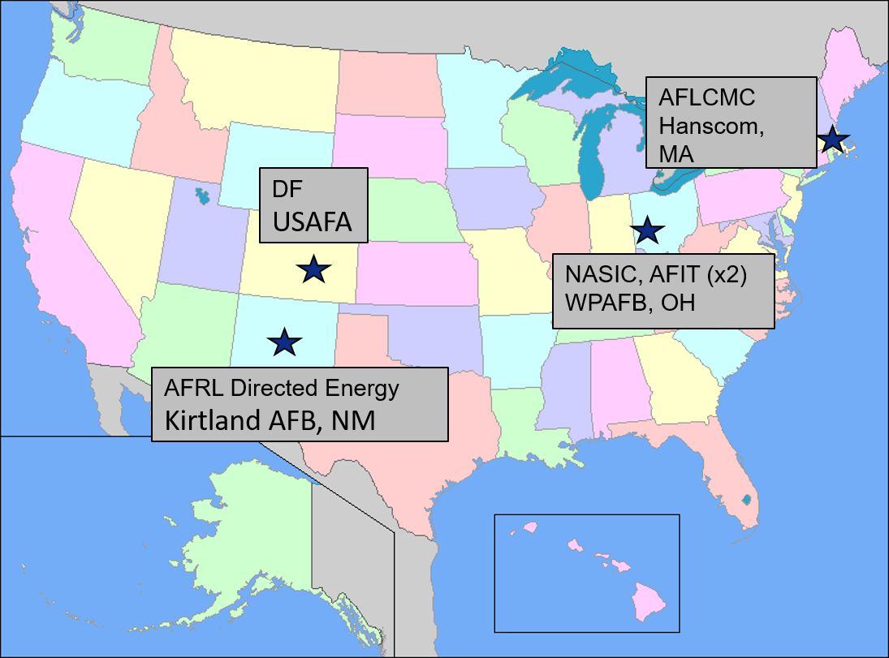
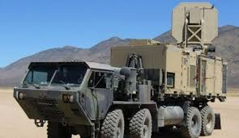
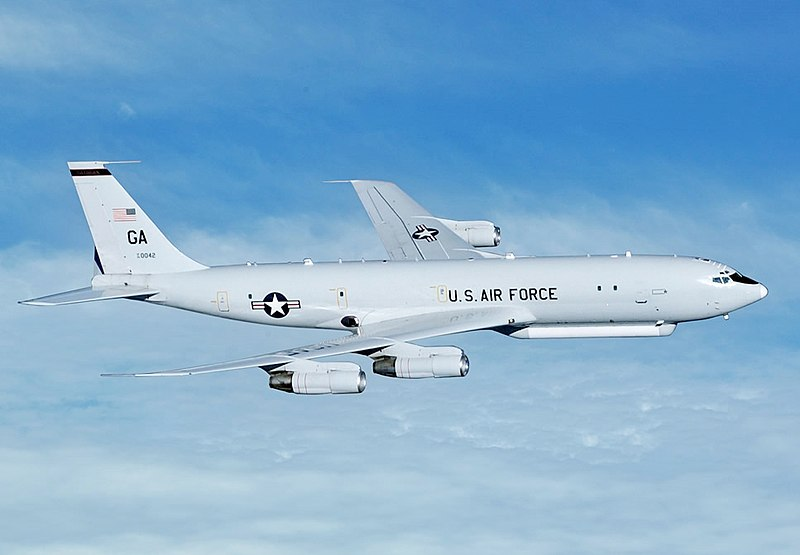
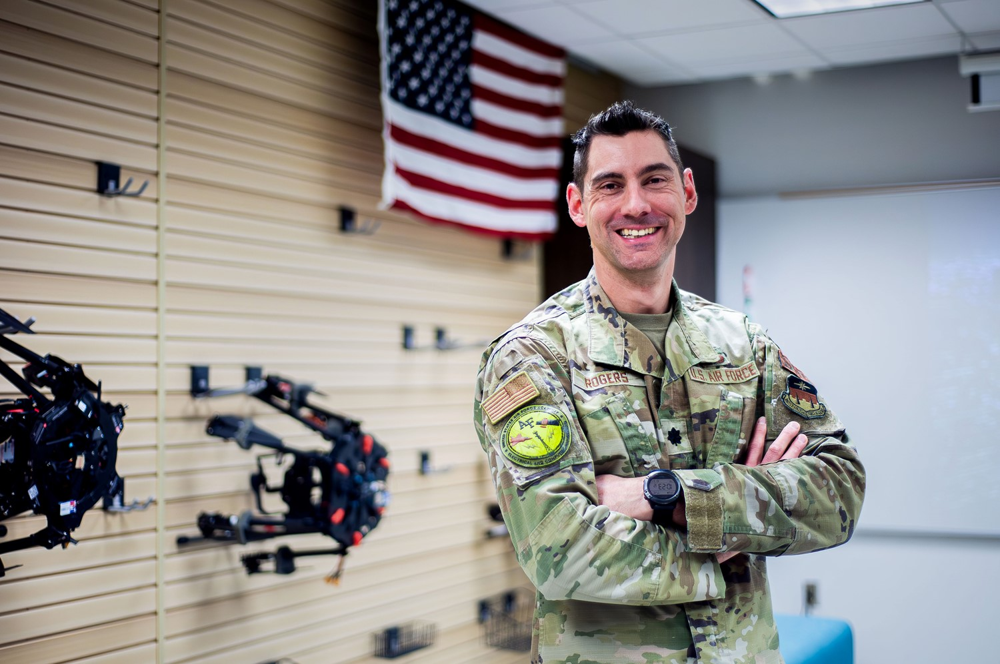
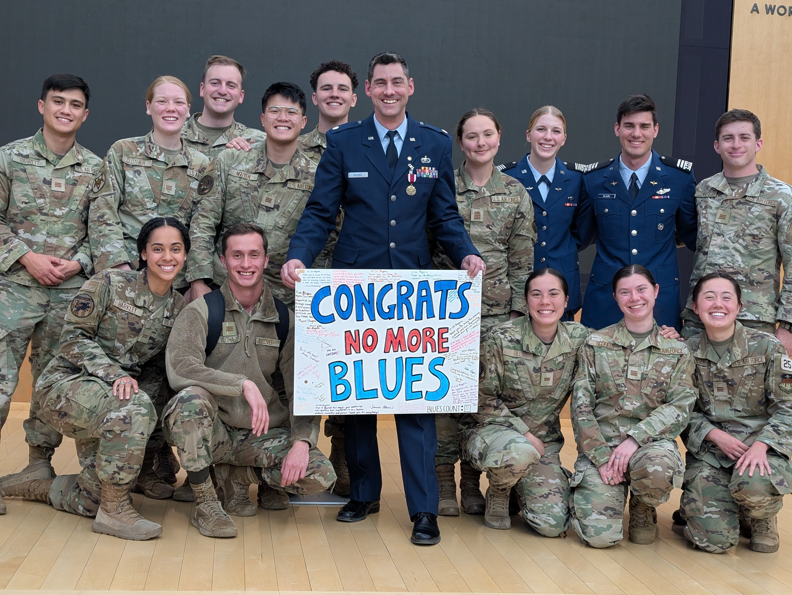
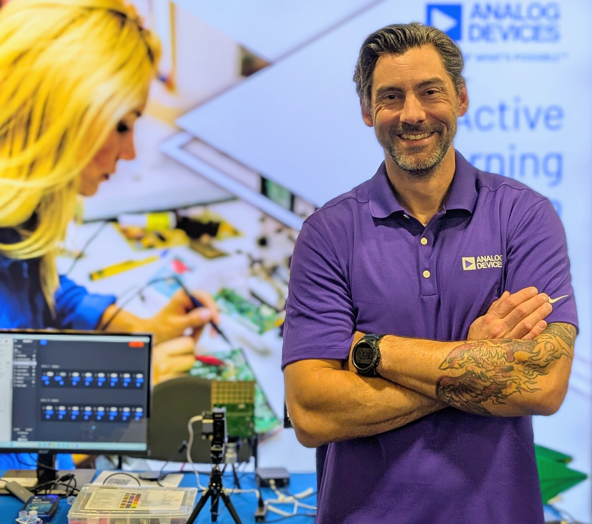
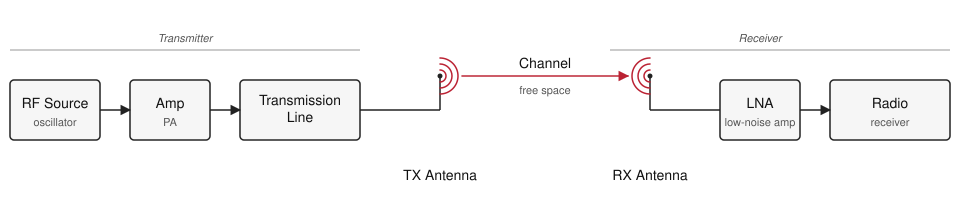

# L1 - Course Introduction

:::{admonition} Slides
:class: slides
<a href="../../slides/L01-course-intro.html" target="_blank" rel="noopener">html slides</a>
<a href="../../slides/L01-course-intro.html?print-pdf" target="_blank" rel="noopener">pdf slides</a>
<a href="../../slides/L01-course-intro.md" target="_blank" rel="noopener">raw markdown slides</a>
:::

## Learning Objectives

<ol class="lo-list lo-sublist" style="--module: '1'; --lo: '1'">
  <li>I can state in plain language what an antenna is and what it does in a radio system.</li>
  <li>I can explain why antennas matter across the Air Force mission set (comms, radar, EW, SATCOM, GPS).</li>
  <li>I can identify the five modules of ECE 444 and how they build toward the final capstone.</li>
  <li>I can recognize several real antennas by sight and connect their geometry to the job they do.</li>
</ol>

## Welcome & Introductions

_Instructor and student introductions — background, career interests, prior exposure to RF or radar._

## About Your Instructor

**Lt Col Neil Rogers, USAF (Ret)** — BS from TU; MSEE and PhD from AFIT.
Currently the **Erdle Chair** at USAFA and a **Field Applications Engineer** at **Analog Devices**.

_DF/USAFA · AFRL Directed Energy, Kirtland AFB · NASIC and AFIT (×2), WPAFB · AFLCMC, Hanscom AFB._

_Officer Training School — where it started._

_Active Denial System 2 at AFRL Directed Energy. Section chief for Active Denial and High-Power Sources._

_Deployment with the 379th AEW._

_E-8C Joint STARS — airborne ground surveillance radar._

_Directed the Academy Center for UAS Research (ACUASR) at USAFA through 2025._

_Retirement from active duty — cadets sent me off with "No More Blues."_

My day job with **Analog Devices** puts me shoulder-to-shoulder with the team designing the **ADALM-PHASER** you'll use in Module 3, and customers designing advanced Comms and RADAR systems based on its technology.

_Field Applications Engineer at Analog Devices — the folks who make the ADALM-PHASER._

## Off the clock

_Four kids (ages 11, 13, 15, 17). We just moved into a new house — fixing it up is a running hobby._

_CrossFit._

_Playing guitar with the band at Trace, my church._

## How I teach

- **We're learning this together.** I don't have all the answers, and I'll say so when I don't.
- **Mistakes are part of learning.** Make them cheaply, and make them count.
- **Ask questions.** There is no such thing as a dumb question — if something isn't clicking for you, it's almost certainly not clicking for someone else.

## What is an antenna?

An antenna is the **transducer between a guided wave** (a signal traveling on a cable or waveguide) **and a radiating wave** (a signal traveling freely through space). Every wireless system on Earth has at least one on each end of the link.

Two ideas we'll keep coming back to:

1. Antennas are **reciprocal** — the same antenna transmits and receives with the same pattern.
2. Antennas do **not create energy** — they shape *where* the energy goes.

_A generic RF link. The antennas are the only components that touch free space; everything else is guided-wave._

## Why this matters to you

Antennas are the front door of every RF system the Air Force fields. If the antenna is wrong, nothing downstream can fix it.

- **Communications** — HF/VHF/UHF/SATCOM links, tactical radios, data links.
- **Radar** — surveillance, tracking, targeting, weather, altimeters.
- **Electronic warfare** — direction finding, jamming, protection.
- **Navigation** — GPS, TACAN, ILS, IFF.
- **ISR** — SIGINT payloads, synthetic aperture radar.

By the end of this course you will have designed, measured, and steered real antennas — the same class of hardware sitting on the aircraft, satellite, or ground station you may one day operate or specify.

## Course roadmap

Five modules, forty-one lessons, culminating in an integrated beamforming + radar capstone:

| Module | Focus |
| :-: | :- |
| 1 | Foundations of Electromagnetics and Antennas |
| 2 | Antenna Types, Simulation, and Measurement |
| 3 | Arrays and ADALM-PHASER Beamforming |
| 4 | Radar Fundamentals and FMCW |
| 5 | Capstone Project |

See the [syllabus](../../syllabus.md) for the full schedule and both project descriptions.

## Show & tell - real antennas + SDR

Seven shapes cover most of what the Air Force flies, drives, and parks on a roof. Learn to name them on sight, and to say in one sentence why each one looks the way it does — the geometry *is* the specification.

- **Half-wave dipole** — a resonant wire, fed at the center. The reference workhorse: doughnut pattern, 2.15 dBi, and the antenna every other gain number is quietly compared against.
- **Monopole** — half a dipole standing on a ground plane, which mirrors the missing half. Half the height for the same job, which is why it is the whip on vehicles and handhelds.
- **Patch** — a printed resonant cavity, a metal rectangle over a grounded substrate. Flat and conformal, so it rides the skin of an aircraft or a GPS puck: GPS, telemetry, and the elements of most planar arrays.
- **Horn** — a flared waveguide that eases a guided wave into free space. Clean, predictable pattern, so it serves as the gain standard on the range and as the feed for dishes and reflectors.
- **Yagi** — one driven element plus a parasitic chain of reflector and directors, each re-radiating with the phase that reinforces one direction. Cheap point-to-point gain along the boom.
- **Spiral** — a self-scaling geometry, where each frequency radiates from the part of the curve that happens to be resonant. Extremely wideband and circularly polarized, which is why it shows up on EW and wideband sensing payloads.
- **Parabolic dish** — optics done in metal: a reflector focuses a whole aperture onto a small feed. The highest gain per dollar, and the reason SATCOM and long-range radar look the way they do.

_Activity:_ pass the hardware around, then demonstrate reception with an SDR (RTL-SDR / HackRF / Phaser) tuned to a live signal. Swap antennas on the same signal and discuss what changes on the spectrum display.

_Hardware checklist:_ half-wave dipole (VHF, telescoping) · monopole whip with ground plane · patch (GPS or 2.4 GHz) · pyramidal horn · VHF/UHF Yagi · spiral or log-periodic wideband element · small parabolic dish or reflector, plus an SDR with a laptop and display cable.

## Demo - acoustic beam pattern

_Live demonstration of a small speaker array driven by a multi-channel audio interface, showing how phasing multiple sources produces a directional acoustic beam. Serves as an audible, tangible analog for the phased-array behavior we'll formalize in Module 3._

See the [acoustic antenna simulator concept](../../materials.md) for the build plan.

## Practice

- <a href="../../practice/ECE444_L01_Practice_blank.pdf" target="_blank" rel="noopener">Problem set (PDF)</a>
- <a href="../../practice/ECE444_L01_Practice_SOLUTIONS.pdf" target="_blank" rel="noopener">Solutions (PDF)</a>

## Where this is going

Lesson 2 turns today's plain-language description into physics. We trace the chain from Maxwell's equations to the plane wave, then define the headline parameters every datasheet quotes: radiation intensity, directivity, gain, effective aperture, and beamwidth. Read the assigned sections on **basic antenna properties** before the next class.

Those parameters are the vocabulary for everything that follows. They are what you will measure in Module 2, what pattern multiplication manipulates when we build arrays in Module 3, and what the radar range equation consumes in Module 4. Get comfortable with them now and the rest of the course is bookkeeping on top of ideas you already own.
